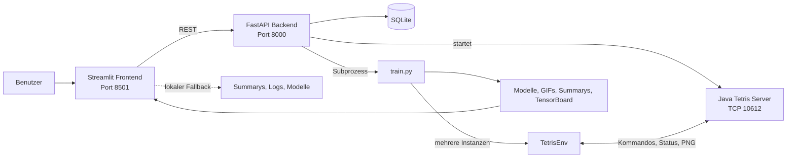

# Tetris Reinforcement Learning – Projektdokumentation

Diese Datei beschreibt den aktuellen Stand des gesamten Projekts: Reinforcement Learning (RL), Tetris-Umgebung, Reward-Funktion, A2C und PPO sowie die konkrete Umsetzung mit Java-Tetris-Server, Gymnasium, Stable Baselines3, FastAPI, SQLite und Streamlit.

Die produktive Trainings- und Web-App-Pipeline liegt in `tetris_env.py` und `streamlit_app/`. Die Notebooks bleiben für Experimente nützlich, sind aber nicht mehr die maßgebliche Art, die Anwendung auszuführen.

## 1. Ziel des Projekts

Das Projekt trainiert ein neuronales Netz darauf, Tetris selbstständig zu spielen. Der Agent erhält keine fest programmierten Regeln wie „baue flach“. Er sieht ein Spielfeldbild, wählt eine von fünf Aktionen und erhält danach eine numerische Belohnung. Aus vielen Interaktionen lernt er, welche Entscheidungen langfristig zu einer hohen Gesamtbelohnung führen.

Die Web-App kann:

- neue Trainingsläufe mit A2C oder PPO starten,
- vorhandene Modelle weitertrainieren,
- laufende Trainings und Logs beobachten,
- abgeschlossene Runs und Vorher-Nachher-GIFs anzeigen,
- ein Modell deterministisch spielen lassen,
- Spielstatistiken und GIFs speichern,
- Modelle und zugehörige Artefakte verwalten.

## 2. Gesamtarchitektur

| Schicht | Implementierung | Aufgabe |
|---|---|---|
| Benutzeroberfläche | `streamlit_app/app.py` | Konfiguration, Navigation, Live-Monitor, Historie, Spiele und Modellverwaltung |
| Web-API | `streamlit_app/backend.py` | REST/WebSocket, Runstatus, SQLite, Starten von Training und Java-Server |
| Trainingsprozess | `streamlit_app/train.py` | Erstellt Environments, A2C/PPO, trainiert und speichert Artefakte |
| RL-Adapter | `tetris_env.py` | Gymnasium-API, TCP-Kommunikation und Reward-Berechnung |
| Spiel-Engine | `TetrisTCPserver_v0.6.jar` | Führt Tetris aus und liefert Zustandsdaten und PNG-Bilder |



Die Trennung hält die Zuständigkeiten klar: Java führt das Spiel aus, Gymnasium standardisiert es, Stable Baselines3 lernt, FastAPI verwaltet Prozesse und Daten, Streamlit stellt alles dar. Die lokalen Fallbacks halten vorhandene Ergebnisse auch ohne laufendes Backend sichtbar.

## 3. Ablauf eines Trainings

1. Im Frontend werden Name, Algorithmus, Timesteps und parallele Environments gewählt.
2. Das Frontend prüft den Tetris-Server auf `127.0.0.1:10612`.
3. Bevorzugt sendet es `POST /runs/start` an FastAPI auf `127.0.0.1:8000`.
4. FastAPI startet `streamlit_app/train.py` als separaten Prozess und schreibt dessen Ausgabe nach `streamlit_logs/<name>.log`.
5. `train.py` erzeugt über `make_vec_env` mehrere `TetrisEnv`-Instanzen mit eigenen TCP-Verbindungen.
6. A2C oder PPO erhält eine `CnnPolicy`, weil die Beobachtung ein RGB-Bild ist.
7. Vor dem Lernen entsteht `<name>_first.gif`.
8. `model.learn(...)` sammelt Erfahrungen und optimiert Policy und Value Function.
9. Modell, `<name>_last.gif` und `training_runs/<name>/summary.json` werden gespeichert.
10. Das Backend erkennt das Prozessende. Mit Summary wird der Run `completed`, ohne Summary `stopped`.

Ist FastAPI nicht erreichbar, kann das Frontend `train.py` lokal starten und Runs aus `training_runs/*/summary.json` lesen. Der empfohlene vollständig verwaltete Betrieb verwendet Backend und Frontend gemeinsam.

## 4. Wie Reinforcement Learning arbeitet

Im Zentrum stehen:

- **Agent:** A2C- oder PPO-Modell;
- **Environment:** `TetrisEnv` und die dahinterliegende Tetris-Instanz;
- **Observation:** aktuelles Spielfeldbild;
- **Action:** ausgewählte Bewegung;
- **Reward:** unmittelbare Bewertung nach einer Aktion;
- **Episode:** ein Spiel von Reset bis Game Over;
- **Policy:** Strategie, die Aktionswahrscheinlichkeiten erzeugt;
- **Value Function:** Schätzung zukünftiger Rewards.

```text
Spielfeldbild -> CNN/Policy -> Aktion -> Tetris -> neuer Zustand + Reward
       ^                                                |
       |----------- Optimierung des Modells <-----------|
```

Das Modell speichert keine Tabelle aller Spielfelder. Ein Convolutional Neural Network (CNN) lernt räumliche Bildmuster und kann dadurch auf neue Spielsituationen verallgemeinern.

### Policy, Value Function und Advantage

Die Policy beantwortet: „Welche Aktion sollte ich wählen?“ Die Value Function schätzt: „Wie viel zukünftiger Reward ist von hier zu erwarten?“ Der **Advantage** vergleicht das tatsächliche Ergebnis mit dieser Erwartung. Besser als erwartete Aktionen werden wahrscheinlicher, schlechtere unwahrscheinlicher. Dieses Actor-Critic-Prinzip verwenden A2C und PPO.

Im Training wird aus der Aktionsverteilung gesampelt und damit exploriert. Im Playground nutzt die App `deterministic=True`; dort wird reproduzierbar die bevorzugte Aktion gewählt.

Ein Timestep ist eine Environment-Interaktion, kein vollständiges Spiel. Bei parallelen Environments verteilen sich die Timesteps auf gleichzeitig laufende Partien.

## 5. Gymnasium-Umgebung `TetrisEnv`

`TetrisEnv` erbt von `gymnasium.Env`. Gymnasium gibt eine feste Schnittstelle vor, sodass unterschiedliche RL-Algorithmen dieselbe Spielumgebung verwenden können.

### Actions

Der Space ist `spaces.Discrete(5)`:

| ID | Aktion | TCP-Kommando |
|---:|---|---|
| `0` | links | `move -1` |
| `1` | rechts | `move 1` |
| `2` | gegen Uhrzeigersinn drehen | `rotate 0` |
| `3` | im Uhrzeigersinn drehen | `rotate 1` |
| `4` | fallen lassen | `drop` |

### Observation

```python
spaces.Box(low=0, high=255, shape=(200, 100, 3), dtype=np.uint8)
```

Die Observation ist ein RGB-Bild mit 200 × 100 Pixeln. Das begründet die `CnnPolicy`. Höhe, Löcher und entfernte Zeilen gehen aktuell nicht direkt in das neuronale Netz ein; sie werden für Reward und Statistiken genutzt. Das Modell entscheidet also visuell, wird aber mithilfe strukturierter Werte bewertet.

### `reset()` und `step()`

`reset()` sendet `start`, empfängt den ersten Zustand, setzt interne Zähler zurück und liefert `(observation, info)`.

`step(action)` übersetzt die Action, empfängt den Folgezustand, berechnet den Reward und liefert:

```python
(observation, reward, terminated, truncated, info)
```

`terminated` ist das Game-Over-Flag. `truncated` bleibt `False`, weil die Environment kein Zeitlimit setzt. `info` enthält `removed_lines`, `lifetime`, `height` und `holes`.

### TCP-Antwortformat

| Bytes | Inhalt | Interpretation |
|---:|---|---|
| 1 | Game Over | `0x01` bedeutet beendet |
| 4 | entfernte Zeilen | unsigned Integer, Big Endian |
| 4 | Höhe | unsigned Integer, Big Endian |
| 4 | Löcher | unsigned Integer, Big Endian |
| 4 | PNG-Größe | Länge der folgenden Bilddaten |
| variabel | PNG | mit OpenCV dekodiertes Spielfeld |

`_recv_all` liest so lange, bis alle Bytes angekommen sind, weil ein einzelnes `socket.recv()` keine vollständige Nachricht garantiert.

## 6. Reward-Funktion

Der Reward ist die Aufgabenbeschreibung für den Agenten. Der Algorithmus kennt nicht den menschlichen Begriff „gutes Tetris“, sondern maximiert die Summe dieser Zahlen.

### Verwendete Werte

| Ereignis | Reward | Absicht |
|---|---:|---|
| Action `drop` | `+5` | aktives Platzieren fördern |
| Höhe steigt um 1 | `-5` | riskante Türme vermeiden |
| ein vorhandenes Loch verschwindet | `+10` | kompaktere Strukturen fördern |
| eine vollständige Reihe verschwindet | `+1000` | das eigentliche Spielziel klar priorisieren |

Mit vorherigem Zustand `s` und neuem Zustand `s'`:

```text
R = 5                              falls action = drop
R = R - 5 * (height' - height)     falls height' > height
R = R + 10 * (holes - holes')      falls holes' < holes
R = R + 1000 * (lines' - lines)    falls lines' > lines
```

Beispiele:

```text
Drop und Höhe +2:          +5 - 2*5    = -5
Drop und eine Reihe:       +5 + 1000   = 1005
Drei Löcher entfernt:      3*10        = 30
```

### Warum diese Gewichtung?

1. **Reihen löschen** dominiert, weil dies das Hauptziel von Tetris ist.
2. **Löcher reduzieren** ist ein Hilfsziel für zukünftige Line Clears.
3. **Höhe begrenzen** unterstützt längeres Überleben.
4. **Drop** liefert schon früh dichtes Feedback, wenn Line Clears noch selten sind.

Der Agent lernt damit nicht abstrakt „optimal spielen“, sondern konkret: Drops verwenden, Höhenzuwachs vermeiden, vorhandene Löcher beseitigen und entfernte Reihen extrem stark priorisieren. Jede Strategie, die diese Zahlen erhöht, ist für das Modell attraktiv – auch wenn sie für Menschen ungewöhnlich aussieht.

### Konsequenzen und Grenzen

- Neue Löcher werden nicht direkt bestraft; belohnt wird nur ihre spätere Reduktion.
- Sinkende Höhe bekommt keinen eigenen Bonus; nur eine Erhöhung wird bestraft.
- Game Over hat keine zusätzliche Endstrafe. Es wirkt nur indirekt durch das Ende weiterer Rewards.
- Der Drop-Bonus kann viele Drops begünstigen, unabhängig von ihrer Qualität.
- Bei `reset()` werden interne Höhe und Lochanzahl auf null gesetzt, statt die Werte des ersten Serverzustands zu übernehmen. Der erste folgende Vergleich beginnt daher bei null.
- Ein Line Clear entspricht dem Reward von 200 Drops. Die Zeilenkomponente dominiert das Lernsignal deutlich.

Diese Punkte sind Eigenschaften der aktuellen Zielfunktion. Änderungen sollten als neue Reward-Version dokumentiert werden, damit alte und neue Runs vergleichbar bleiben.

## 7. A2C und PPO

Beide sind On-Policy-Actor-Critic-Verfahren aus Stable Baselines3. Sie lernen vor allem aus Daten der aktuellen Policy und verwenden Actor, Critic und Advantage.

Das Projekt setzt nur Algorithmus, `CnnPolicy`, Environments und TensorBoard-Pfad explizit. Lernrate, Discount-Faktor, Rollout-Länge und weitere Hyperparameter stammen aus den Defaults der installierten Stable-Baselines3-Version.

### A2C – Advantage Actor-Critic

A2C sammelt synchron Rollouts aus allen parallelen Environments und aktualisiert danach Actor und Critic.

- **Stärken:** einfacher Ablauf, häufige Updates, gute Nutzung vieler Environments, schnelle Baseline.
- **Grenzen:** höhere Update-Varianz möglich, empfindlich gegenüber Reward-Skalen, Daten werden nach dem Update nicht mehrfach verwendet.

### PPO – Proximal Policy Optimization

PPO begrenzt über ein geclipptes Wahrscheinlichkeitsverhältnis, wie stark sich die Policy in einem Update ändern darf. Ein Rollout-Batch wird typischerweise über mehrere Optimierungsepochen genutzt.

- **Stärken:** kontrolliertere, häufig stabilere Updates und bessere Batch-Nutzung.
- **Grenzen:** mehr Rechenaufwand pro Timestep und oft längere Laufzeit.

| Eigenschaft | A2C | PPO |
|---|---|---|
| Update | direkt und synchron | geclippt und begrenzt |
| Batch-Nutzung | einmal | mehrere Epochen |
| Rechenaufwand | eher geringer | eher höher |
| typische Rolle | schnelle Baseline | robuste Optimierung |

Ein fairer Vergleich benötigt dieselbe Reward-Version, Timesteps, Environment-Zahl, Startbedingungen, Evaluation und möglichst feste Seeds. Laufzeit allein misst keine Modellqualität.

## 8. Parallele Environments und Fortsetzung

`make_vec_env(TetrisEnv, n_envs=n_envs)` sammelt gleichzeitig Erfahrungen aus mehreren Spielen. Das reduziert die Abhängigkeit von einer einzelnen Episode, kostet aber TCP-Verbindungen, CPU, Bildverarbeitung und Speicher. Die Web-App startet mit `4`; größere Runs wurden auch mit `20` Environments durchgeführt.

Beim Fortsetzen wird `models/<quelle>.zip` geladen. Der Algorithmus der Quelle wird übernommen:

```python
model = algorithm_class.load(resume_model_path, env=vec_env)
model.learn(total_timesteps=additional_timesteps, reset_num_timesteps=False)
```

Die Summary trennt `base_timesteps`, neu angeforderte `requested_timesteps`, deren Summe `final_timesteps` und `resume_from`. Ein neuer Runname verhindert versehentliches Überschreiben.

## 9. Backend und API

### Lebenszyklus

Beim Backend-Start wird die SQLite-Tabelle `runs` angelegt oder migriert. Der FastAPI-Lifespan prüft danach den Java-Server und startet die JAR bei Bedarf. Beim Beenden wird nur der Java-Prozess beendet, den dieses Backend selbst gestartet hat. Seine Ausgabe steht in `streamlit_logs/tetris_server.log`.

### REST und WebSocket

| Methode | Pfad | Aufgabe |
|---|---|---|
| `POST` | `/runs/start` | Training als Subprozess starten |
| `POST` | `/runs/stop/{name}` | `SIGTERM` an die gespeicherte PID senden |
| `GET` | `/runs` | Runs listen; optional `?status=running` oder `completed` |
| `GET` | `/runs/{name}` | Details und Summary liefern |
| `GET` | `/runs/{name}/log` | letzte maximal 8192 Bytes des Logs liefern |
| WebSocket | `/ws/runs/{name}` | Status, Log und Fortschritt bei Änderungen senden |

Startbeispiel:

```json
{
  "name": "experiment_01",
  "timesteps": 100000,
  "n_envs": 8,
  "resume_from": null,
  "algorithm": "PPO"
}
```

Ist der Tetris-Server nicht erreichbar, antwortet der Start mit HTTP `409`. Unbekannte Runs liefern `404`.

Stable Baselines3 schreibt `total_timesteps` in das Textlog. Backend und Frontend extrahieren den neuesten Wert mit regulären Ausdrücken. Der Fortschritt ist daher eine abgeleitete Anzeige. Für fortgesetzte Runs gilt:

```text
additional_current = max(0, current_timesteps - base_timesteps)
progress = additional_current / requested_timesteps
```

Der WebSocket aktualisiert ungefähr sekündlich und sendet nur geänderte Payloads. Das aktuelle Streamlit-Frontend verwendet für seinen Live-Monitor ein sekündliches Streamlit-Fragment mit REST- und Logabfragen; der vorhandene WebSocket wird von ihm noch nicht direkt genutzt.

## 10. Persistenz und Artefakte

SQLite speichert in `streamlit_app.db` Name, PID, Logpfad, Status, Zeitstempel, Algorithmus, Environment-Zahl und Timestep-Zähler. Fachliche Ergebnisse liegen zusätzlich als Dateien vor:

```text
models/<name>.zip                       trainiertes SB3-Modell
training_runs/<name>/summary.json       dauerhafte Run-Zusammenfassung
streamlit_logs/<name>.log               Trainingsausgabe
streamlit_logs/current_run.json         lokaler Frontend-Fallback
streamlit_logs/tetris_server.log         Java-Server-Ausgabe
gifs/<name>_first.gif                    Spiel vor dem Training
gifs/<name>_last.gif                     Spiel nach dem Training
gifs/play_<name>_<timestamp>.gif         manuell gestartetes Modellspiel
gifs/play_<name>_<timestamp>.json        Statistiken dieses Spiels
tb_logs/                                  TensorBoard-Events
```

SQLite erleichtert die Runverwaltung. `summary.json` bleibt zusammen mit dem Modell transportierbar und kann ohne Backend gelesen werden.

## 11. Frontend

Das Streamlit-Frontend trägt das Branding „Blocklab“. `.streamlit/config.toml` und CSS in `app.py` steuern nur die Darstellung; Backend und Datenhandling bleiben getrennt.

### Training

- A2C/PPO, Name, Timesteps und Environment-Zahl setzen;
- Tetris-Server prüfen;
- Metriken, Fortschritt und Log live anzeigen;
- abgeschlossene Modelle mit zusätzlichen Timesteps fortsetzen.

### Playground

- trainiertes Modell auswählen;
- maximale Schritte und Frame-Dauer setzen;
- Modell mit `deterministic=True` ausführen;
- Reward, Zeilen, Höhe, Löcher, Dauer und Actions anzeigen;
- GIF und Statistik-JSON speichern und ältere Spiele öffnen.

### Modelle

- Algorithmus, Timesteps, Environments, Größe und Änderungsdatum anzeigen;
- Summary öffnen;
- Modell und optional Runordner, GIFs und Logs löschen;
- Löschung durch Eingabe des Modellnamens bestätigen.

### Historie

- abgeschlossene Runs auswählen;
- Status, Dauer, Timesteps, Environments und Fortsetzungsquelle sehen;
- erstes und letztes Spiel vergleichen;
- Summary und Log einsehen.

### Fallback-Verhalten

Wenn `GET /runs` erreichbar ist, nutzt das Frontend FastAPI. Sonst liest es lokale Summarys, Logs und Modelle. Damit bleibt die Historie sichtbar, auch wenn nur Streamlit läuft. Für verwaltete Starts und den automatischen Java-Start sollten beide Dienste laufen.

## 12. Verwendete Technologien

Die Versionen stammen aus dem aktuellen `pdm.lock` und der installierten Umgebung:

| Technologie | Version | Aufgabe |
|---|---:|---|
| Python | 3.12 | Sprache und Laufzeit |
| Gymnasium | 1.3.0 | Environment-, Action- und Observation-API |
| Stable Baselines3 | 2.9.0a2 | A2C, PPO, Policy, Training und Modellformat |
| PyTorch | 2.12.0 | neuronale Netze und Gradienten |
| NumPy | 2.4.6 | Arrays und numerische Verarbeitung |
| OpenCV | 4.13.0.92 | PNG-Dekodierung aus TCP |
| ImageIO | 2.37.3 | GIF-Erzeugung |
| Streamlit | 1.58.0 | Frontend |
| FastAPI | 0.136.3 | REST- und WebSocket-Backend |
| Uvicorn | 0.49.0 | ASGI-Server |
| Requests | 2.34.2 | Frontend-HTTP-Client |
| SQLite | Standardbibliothek | Run-Metadaten |
| TensorBoard | 2.20.0 | Trainingskurven |
| Pytest | 9.0.3 | Tests |
| PDM | Projektwerkzeug | Dependencies und Scripts |

### Warum diese Werkzeuge?

- **Gymnasium** trennt das konkrete Spiel vom Lernalgorithmus. Jede kompatible Environment kann von unterschiedlichen Algorithmen genutzt werden.
- **Stable Baselines3** liefert geprüfte A2C-/PPO-Implementierungen, Rollout-Buffer, Optimierung und Modellserialisierung.
- **PyTorch** bildet die `CnnPolicy` und berechnet automatisch Gradienten.
- **OpenCV** dekodiert die binären PNG-Antworten effizient in NumPy-Arrays.
- **FastAPI** kapselt Prozessverwaltung und Persistenz außerhalb des UI-Renderzyklus.
- **Streamlit** macht Konfiguration, Monitoring und Auswertung schnell interaktiv.
- **TensorBoard** visualisiert Lernmetriken über die Zeit.
- **PDM** hält Abhängigkeiten über `pyproject.toml` und `pdm.lock` reproduzierbar.

## 13. Installation und Start

Vorausgesetzt werden Python 3.12, PDM, eine Java-Laufzeit und `TetrisTCPserver_v0.6.jar` im Projektroot.

```bash
pdm install
```

Empfohlener Start in zwei Terminals:

```bash
# Terminal 1: API, SQLite und automatischer Java-Start
pdm run backend

# Terminal 2: Oberfläche
pdm run app
```

- Frontend: `http://127.0.0.1:8501`
- OpenAPI/Swagger: `http://127.0.0.1:8000/docs`
- Tetris TCP: `127.0.0.1:10612`

Nur bei einem direkten Start ohne Backend muss die JAR vorher manuell laufen:

```bash
java -jar TetrisTCPserver_v0.6.jar
```

Direktes Training:

```bash
pdm run python streamlit_app/train.py \
  --name experiment_01 \
  --timesteps 100000 \
  --n_envs 8 \
  --algorithm A2C
```

Fortsetzung:

```bash
pdm run python streamlit_app/train.py \
  --name experiment_01_cont \
  --timesteps 50000 \
  --n_envs 8 \
  --algorithm A2C \
  --resume-from experiment_01
```

## 14. Auswertung

Ein Modell sollte nicht nur nach einem Gesamt-Reward beurteilt werden. Wichtige Größen sind:

- entfernte Zeilen,
- Episodenlänge und Überlebensdauer,
- finale Höhe und Lochanzahl,
- Reward pro Schritt,
- Action-Verteilung,
- mehrere deterministische Testspiele,
- Trainingskurven in TensorBoard.

```bash
pdm run tensorboard --logdir tb_logs
```

Für einen belastbaren A2C/PPO-Vergleich sind mehrere Runs pro Konfiguration und feste Seeds nötig. Ein einzelnes GIF ist anschaulich, aber nicht statistisch ausreichend.

### Aktuell vorhandene Beispielkonfigurationen

Die gegenwärtigen Summary-Dateien dokumentieren unter anderem diese Läufe:

| Run | Algorithmus | neu trainierte Timesteps | Gesamtstand | Environments |
|---|---|---:|---:|---:|
| `test` | A2C | 10.000 | 10.000 | 4 |
| `Run_1` | A2C | 200.000 | 1.200.000 | 20 |
| `RUN_PPO` | PPO | 600.000 | 600.000 | 20 |

Diese Werte beschreiben gespeicherte Experimente, nicht automatisch optimale Einstellungen. Insbesondere sind 1.200.000 A2C-Timesteps und 600.000 PPO-Timesteps kein kontrollierter Direktvergleich. Die Web-App verwendet für einen neuen Run standardmäßig 10.000 Timesteps und 4 Environments; beide Werte sind vor dem Start änderbar.

## 15. Tests

```bash
pdm run pytest -q
```

Aktuell existieren:

- isolierte Tests der Reward-Beispiele;
- ein als Integrationstest angelegter lokaler TCP-Stub;
- darin vorgesehene Prüfungen grundlegender `TetrisEnv`-Rückgabetypen.

Beim aktuellen Aufruf mit `pdm run pytest -q` wird der TCP-Test übersprungen, wenn `TetrisEnv` im Pytest-Importpfad nicht aufgelöst wird. Die derzeit verlässlich ausgeführten drei Tests betreffen die Reward-Beispiele. Der Stub simuliert grundsätzlich das binäre Java-Antwortformat, sein eingebettetes PNG sollte für eine dauerhaft aktive Integration zusätzlich gegen die aktuelle OpenCV-Version validiert werden. Die Reward-Tests duplizieren die Berechnung noch als Testfunktion. Sinnvolle Verbesserungen sind daher ein stabiler Projektimport, ein gültiges Test-PNG und eine direkt importierte Produktionsfunktion `compute_reward`.

## 16. Aktuelle Grenzen und nächste Schritte

- Reward-Werte sind fest im Code und haben noch keine Versionskennung.
- Seeds werden nicht in der Web-App gespeichert; vollständige Reproduzierbarkeit fehlt.
- Weitere Hyperparameter sind nicht über die Oberfläche konfigurierbar.
- Die Policy sieht nur Pixel, nicht die strukturierten Zustandswerte.
- Fortschritt wird aus Textlogs gelesen; ein strukturierter Callback wäre robuster.
- API und WebSocket haben keine Authentifizierung und sind für lokalen Betrieb gedacht.
- Ein aktiver Run ist der praktische Normalfall; parallele Trainings konkurrieren um Ressourcen.
- Es fehlt eine feste Zahl automatischer Evaluationsepisoden mit Mittelwert und Streuung.

Empfohlene nächste Experimente:

1. aktuelle Funktion als `reward_v1` festhalten;
2. direkte Strafe für neue Löcher und Game Over als `reward_v2` vergleichen;
3. A2C und PPO mit identischen Timesteps, Environments und Seeds testen;
4. mehrere Evaluationsepisoden in jeder Summary speichern;
5. Reward-Version und wichtige Hyperparameter in UI, SQLite und Summary aufnehmen.

## 17. Projektstruktur

```text
.
├── .streamlit/config.toml              Theme
├── tetris_env.py                       Environment, TCP und Reward
├── TetrisTCPserver_v0.6.jar            Spielserver
├── streamlit_app/
│   ├── app.py                           Frontend und lokaler Fallback
│   ├── backend.py                       API, SQLite und Prozesse
│   └── train.py                         A2C-/PPO-Training
├── models/                              SB3-Modelle
├── training_runs/<name>/summary.json   Run-Metadaten
├── gifs/                                Trainings- und Playground-GIFs
├── streamlit_logs/                      Trainings- und Serverlogs
├── tb_logs/                             TensorBoard-Daten
├── tests/                               Reward- und TCP-Tests
├── docs/                                Dokumentation
├── pyproject.toml                       Abhängigkeiten und PDM-Scripts
└── pdm.lock                             aufgelöste Versionen
```

## 18. Fazit

Das Projekt bildet eine vollständige lokale RL-Anwendung ab: Java liefert Tetris-Zustände, `TetrisEnv` übersetzt sie in Gymnasium und berechnet den Reward, Stable Baselines3 trainiert eine visuelle A2C- oder PPO-Policy, FastAPI verwaltet Prozesse und Metadaten, und Streamlit macht Training und Auswertung bedienbar.

Der wichtigste fachliche Hebel ist nicht nur A2C oder PPO, sondern die Reward-Funktion. Sie definiert, was „gut“ bedeutet. Die Algorithmen unterscheiden sich darin, wie sie aus dieser Rückmeldung lernen – optimieren aber beide exakt das Signal, das die Environment vorgibt.
